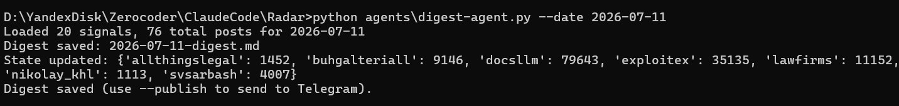
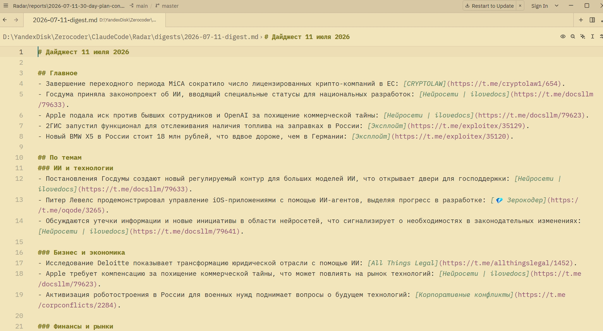
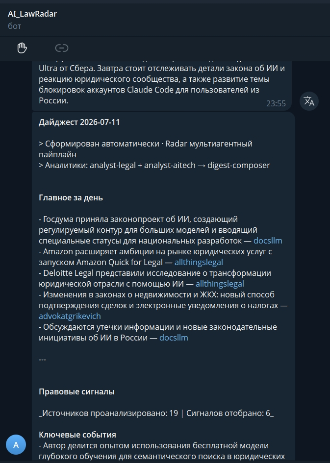

# TG Radar

**Мультиагентный мониторинг Telegram-каналов про ИИ в праве с автопубликацией дайджеста.**

Radar собирает сообщения из ~85 Telegram-каналов по теме ИИ и legal-tech, отсеивает шум через OpenAI, готовит аналитический дайджест силами нескольких агентов и публикует его в Telegram-канал. Ручной час чтения ленты превращается в готовую выжимку за день.

У проекта нет HTML-страниц, форм и UI – это конвейер данных: источники → агенты → публикация. Полное описание проекта по структуре выпускного задания – в [PROJECT.md](PROJECT.md).

## Скриншоты

> Скриншоты работающего проекта. Замените плейсхолдеры на свои файлы в папке `images/`.

**Запуск пайплайна в терминале**



**Готовый дайджест (Markdown)**



**Опубликованный пост в Telegram-канале**



## Что делает Radar

1. **Сбор** – забирает новые сообщения из ~85 Telegram-каналов по протоколу MTProto.
2. **Фильтрация** – отсеивает шум через OpenAI, оставляет сигналы по ИИ и legal-tech.
3. **Анализ** – специализированные агенты (`analyst-legal`, `analyst-aitech`) разбирают сигналы по направлениям.
4. **Композиция** – `digest-composer` собирает разборы агентов в единый дайджест.
5. **Публикация** – готовый дайджест публикуется в Telegram-канал через Bot API.

## Запуск локально

```bash
# 1. Клонировать репозиторий
git clone https://github.com/advocatalexy-cell/TG_Radar.git
cd TG_Radar

# 2. Виртуальное окружение и зависимости
python -m venv .venv
source .venv/bin/activate          # Windows: .venv\Scripts\activate
pip install -r requirements.txt

# 3. Секреты (см. раздел «Секреты») – скопировать и заполнить
cp .env.example .env               # затем вписать свои ключи

# 4. Запустить весь пайплайн
python scripts/run-pipeline.py

# Частичный прогон
python scripts/run-pipeline.py --skip-fetch      # без сбора, только фильтр + дайджест
python scripts/filter-signals.py --date 2026-05-20   # backfill конкретной даты
```

Готовый дайджест появится в `digests/YYYY-MM-DD-digest.md`.

## Архитектура

Проект развернут не на одной платформе, а на двух звеньях – каждое отвечает за то, что физически может делать:

| Звено | Задача | Почему там |
|---|---|---|
| **VPS** (Beget, Литва) | Сбор из Telegram (MTProto/Telethon) и публикация (Bot API) | Оба вида трафика не проходят через egress-прокси облачной песочницы Anthropic: MTProto рвется с ошибкой на уровне TCP, Bot API возвращает 403 Forbidden от прокси |
| **Облачный Routine** (claude.ai) | Мультиагентный ИИ-анализ (`analyst-legal`, `analyst-aitech`, `digest-composer`) | Сети наружу не требуется, кроме GitHub и OpenAI API – оба разрешены |

Связующий слой – публичный GitHub-репозиторий [`advocatalexy-cell/TG_Radar`](https://github.com/advocatalexy-cell/TG_Radar):

- VPS пушит туда сырые данные после сбора;
- облачный Routine читает их, прогоняет через агентов и коммитит обратно готовый дайджест;
- VPS публикует дайджест из репозитория в канал.

Чистый VPS без Routine не дает мультиагентной оркестрации Claude Code. Чистый Routine без VPS не может физически достучаться до Telegram. Поэтому нужны оба звена.

```
Telegram-каналы (~85)
        │  MTProto (Telethon)
        ▼
      VPS: сбор
        │  git push (сырые данные)
        ▼
   GitHub-репозиторий
        │  git pull
        ▼
Облачный Routine: analyst-legal → analyst-aitech → digest-composer
        │  git push (готовый дайджест)
        ▼
   GitHub-репозиторий
        │  git pull
        ▼
      VPS: публикация (Bot API)
        │
        ▼
   Telegram-канал
```

## Структура репозитория

```
Radar/
├── sources/          # конфиги источников (channels.json)
├── scripts/          # сбор, фильтрация, оркестратор, публикация
├── agents/           # digest-agent, промпт post-adapter
├── data/raw/         # сырые данные из источников (только чтение)
├── data/processed/   # отфильтрованные сигналы
├── data/analysis/    # разборы агентов по направлениям
├── digests/          # готовые дайджесты по датам
├── posts/            # адаптированные посты под площадки (JSON)
├── .claude/          # агенты, команды и скиллы Claude Code
├── PROJECT.md        # описание проекта по структуре урока
└── README.md         # этот файл
```

## Скиллы Claude Code

- **`post-adapter`** – превращает новость или фрагмент дайджеста в готовые посты под Telegram-канал Radar и корпоративный портал Bitrix24 (JSON в `posts/`).
- **`radar-dev`** – помогает Claude Code работать с этим репозиторием: понимать структуру, запускать пайплайн, вносить изменения, обновлять README, проверять ошибки и готовить проект к публикации.

Скиллы лежат в `.claude/skills/` и публикуются вместе с репозиторием.

## Стек

- Python 3.12, venv
- Telethon (MTProto-клиент для сбора)
- Telegram Bot API (публикация)
- OpenAI API (фильтрация сигналов, мультиагентный анализ)
- Claude Code / облачный Routine (оркестрация агентов)
- cron (расписание на VPS)

## Расписание (cron на VPS, время МСК)

| Время | Задача |
|---|---|
| 17:00 | Сбор сообщений из Telegram-каналов |
| 18:00 | Запуск облачного Routine (настроен отдельно через API) |
| 18:30 | Публикация дайджеста в Telegram-канал |

## Секреты

Передаются через `.env` на VPS и через переменные окружения облачного Environment на claude.ai – никогда не через код и не в git:

- `TELEGRAM_API_ID`
- `TELEGRAM_API_HASH`
- `TELEGRAM_PHONE`
- `TELEGRAM_SESSION_STRING`
- `TELEGRAM_BOT_TOKEN`
- `TELEGRAM_CHAT_ID`
- `OPENAI_API_KEY`

Доступ к VPS – по SSH-ключу. Для GitHub на сервере сгенерирован отдельный deploy-key; приватная часть ключа никогда не покидала VPS.

## Статус

Проведен полный end-to-end прогон в реальном времени – дайджест успешно дошел до Telegram-канала. Пайплайн работает по расписанию.

## Лицензия

–
